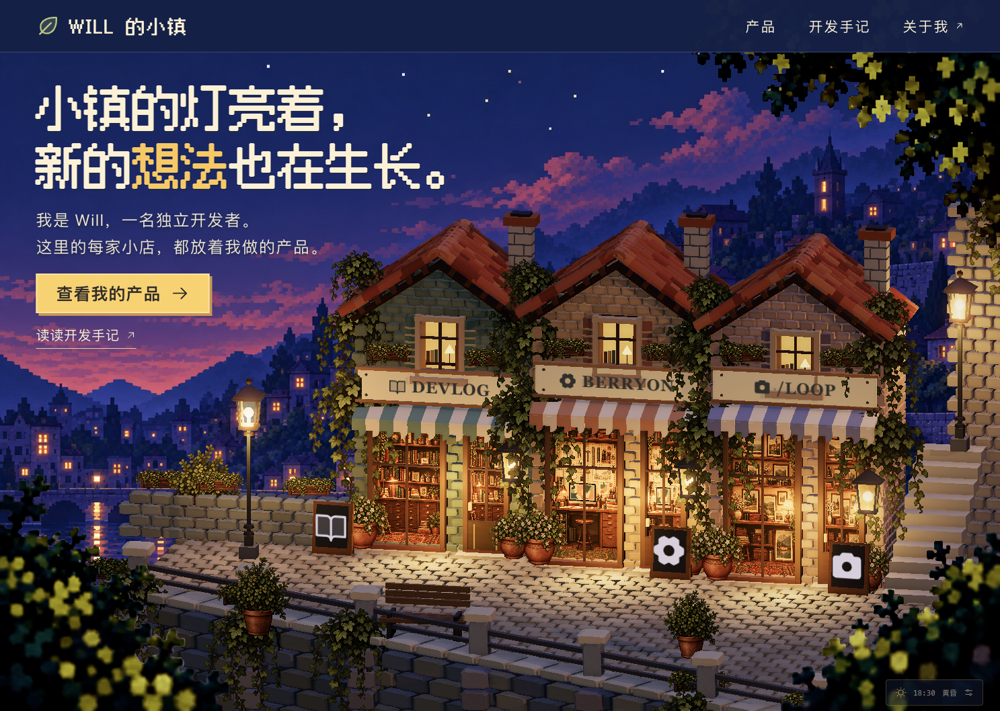

# Will Town · Will 的小镇

一个人，慢慢建起一条街。

**在线体验：[will-town.haruhowell.workers.dev](https://will-town.haruhowell.workers.dev)**

以像素小镇呈现独立开发者的产品：每家店代表一个产品，访客直接点击店铺查看产品与故事。天空与灯光跟随设备当地时间变化。

**当前状态：固定镜头的像素街景展示，完整美术验收未通过。** 人物与行走功能已移除，集中打磨建筑、材质和光影。保留校准过的桌面镜头、实体岸墙、直接点击的店铺入口及设备当地时间的昼夜变化。



上图为 ego-lite 实际运行截图。对照 [修改前](docs/preview.jpg)、[视觉概念稿](docs/references/town-concept.png)、[本轮参考与结构修改](docs/visual-direction.md) 和 [验收记录](design-qa.md)。这轮细化了叠压屋瓦、石块倒角、木构表面、上层窗内陈设和局部阴影；镜头参数保持不变。几个屏幕定位点的误差小于 25px 不等于整图 90% 相似度。屋瓦、石材、花卉密度和光照精细度仍有明显差距。

## 首版目标

- 一个小广场与三个店面，保持近距离、能看清建筑与橱窗的取景。
- 完成至少一家店的“发现 → 了解 → 打开真实产品”流程。
- 点击店招或首页产品按钮查看产品，Esc 关闭面板。
- 固定角度镜头；手机以 Berryon 店面为中心，不跟随、不旋转。
- 根据当地时间展示晨曦、上午、午间、下午、黄昏和夜晚，配合预设太阳光照。
- 支持录制约 25 秒的演示，开发预览可调时间；正常访问按真实时间运行。

## 运行

使用 Node.js 22.12 或以上及 pnpm 9.15。

```sh
pnpm install --frozen-lockfile
pnpm dev
```

Vite 会输出本地地址。开发验收使用端口 4173；也可运行 `pnpm dev --port 4173 --strictPort`。

```sh
pnpm typecheck
pnpm test
pnpm build
pnpm test:sites
```

构建输出位于 `dist/client/`。仓库保留了可选 Sites 部署结构。

## Cloudflare 部署

使用 Workers Static Assets 发布 `dist/client/`，配置位于 `wrangler.jsonc`。初次部署前通过 `pnpm exec wrangler login` 登录目标 Cloudflare 账户，再执行：

```sh
pnpm deploy:cloudflare
```

命令会重新构建并上传静态产物；公开地址以 Wrangler 成功部署时的输出为准。单页导航由 Cloudflare 返回 `index.html`，无需数据库或运行时密钥。原始参考附件和源码不会作为部署目录上传。

当前已通过官方 Cloudflare MCP 和 Static Assets 直传 API 发布到上述地址，Worker 名为 `will-town`。MCP 授权与本机 Wrangler 登录独立；使用命令行更新时仍需有效的 Wrangler 登录。

## 操作

- 点击「查看我的产品」打开产品列表，或直接点击店招与橱窗。
- Esc 关闭展示面板并恢复入口焦点。
- 手机上直接点击店铺，或通过顶部「产品」访问全部入口。
- 右下角时钟可切换晨光、正午、黄昏、夜晚，或加速播放一天。默认跟随设备时间。
- 时间面板内「干净取景」隐藏主要导航，便于手动录屏；Esc 退出。预览状态保留标注。
- 产品入口不依赖 3D 成功加载；关闭 JavaScript 时仍提供 Berryon 的普通链接。

## 技术栈

TypeScript + React + Vite + Three.js + React Three Fiber，使用 pnpm 管理依赖，兼容版本已锁定在 pnpm-lock.yaml。

Three.js 渲染小镇，React 组织网页内容，React Three Fiber 将场景组织成可复用组件。首版采用纯前端单应用，没有运行时后端或数据库。

详见 [架构方案](docs/architecture.md)、[昼夜方案](docs/day-cycle.md) 与 [素材制作与管理](assets/README.md)。

## 当前边界

三个店面分别为 Berryon、开发手记、Will 工作室。点击店面打开 HTML 展示面板；不包含人物、行走、碰撞、距离触发或可行走的室内场景。原角色素材移至 `assets/source/avatar/retired/`，不再部署或加载。远景是分层氛围图，不对应真实天气或天文日出日落。场景改为按需渲染，时间或视口变化时更新。

下一步优先细化建筑差异、石材与木构层次、橱窗内部纵深和光影构图。方向见 [视觉方案](docs/storefront-direction.md)。
