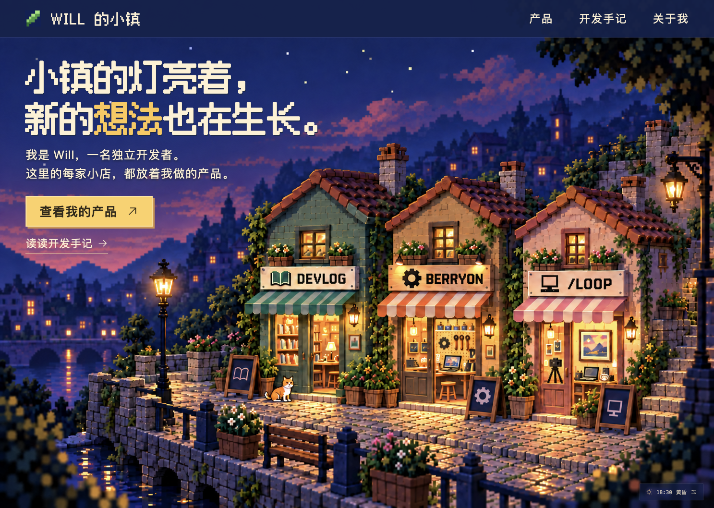

# Will Town · Will 的小镇

一个人，慢慢建起一条街。

**在线体验：[will-town.haruhowell.workers.dev](https://will-town.haruhowell.workers.dev)**

以像素小镇呈现独立开发者的产品。三间小店分别通向开发手记、Berryon 和 Will 的工作室。

当前采用用户确认的预渲染街景：保留实体石岸、细致屋瓦、暖色橱窗和固定构图，以真实 HTML 提供导航、店铺入口和详情弹窗。人物、行走和旧 Three.js 场景已移除。



上图来自 ego-lite 实际页面。对照 [已确认画面](docs/design/street-approval-v1.png)、[并排比较](docs/qa/artwork-comparison-v2.png) 和 [验收记录](design-qa.md)。素材生成会产生局部细节变化，网页字体也与原图略有差异；不宣称逐像素 1:1 或未经证实的相似度百分比。

## 使用

- 点击店招、橱窗或「查看我的产品」，打开对应内容；Berryon 链接通向真实产品。
- Esc 关闭弹窗并恢复入口焦点。手机上保留三间店和直接产品入口。
- 右下角时钟默认跟随设备当地时间，可预览晨光、正午、黄昏和夜晚。
- 时段只轻微调整画面亮度，保留傍晚美术；没有实时天空、太阳、天气模拟。
- 橱窗有缓慢的局部明暗呼吸；系统设置减少动态时关闭。
- 时间面板的「干净取景」隐藏网页控件供录屏，Esc 返回。
- 图像加载失败仍可使用 HTML 导航；禁用 JavaScript 时提供 Berryon 普通链接。

## 运行与验证

Node.js 22.12+，pnpm 9.15。

```sh
pnpm install --frozen-lockfile
pnpm dev --port 4173 --strictPort
pnpm typecheck
pnpm test
pnpm build
pnpm test:sites
```

TypeScript + React + Vite，无 WebGL、游戏引擎、数据库或运行时后端。构建网页位于 `dist/client/`；可选 Sites 兼容结构保留。

## 发布

Cloudflare Workers Static Assets，Worker 名称 `will-town`，配置 `wrangler.jsonc`。有有效 Wrangler 登录时运行 `pnpm deploy:cloudflare`。也可通过已授权的 Cloudflare MCP 与 Static Assets 直传 API 发布同一构建目录。MCP 授权和 Wrangler 登录相互独立。

只上传 `dist/client/`，不上传源码、参考附件和未选用的生成候选。

## 素材与架构

- [当前架构](docs/architecture.md)
- [时间效果边界](docs/day-cycle.md)
- [素材目录与来源](assets/README.md)
- [署名与许可](CREDITS.md)
- [历史实时 3D 验收记录](docs/qa/realtime-design-qa.md)
