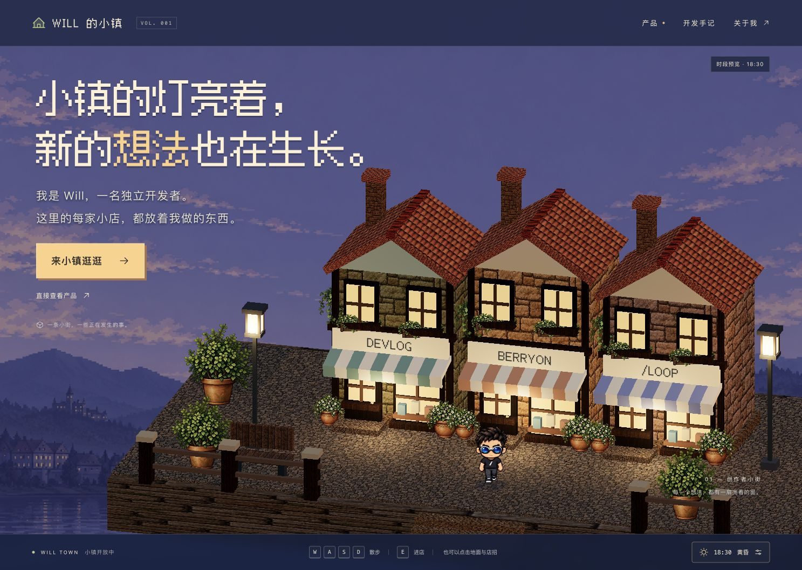

# Will Town · Will 的小镇

一个人，慢慢建起一条街。

以像素小镇呈现独立开发者的产品：每家店代表一个产品，访客可以直接点击店铺，也可以控制像素分身沿街探索。天空与灯光跟随设备当地时间变化。

**当前状态：首个可运行样片。** 已实现真实 Three.js 街道、基于 Will 形象的像素角色、Berryon 产品入口，以及跟随设备时间的昼夜变化。建筑采用可复用几何模块，视觉细节仍在迭代。



上图为实际运行截图。另见 [视觉概念稿](docs/references/town-concept.png) 与 [验收记录](design-qa.md)。交互样片已经可用，建筑陈设和光照层次尚未达到概念稿的视觉精度。

## 首版目标

- 一个小广场与三个店面，保持近距离、能看清像素分身和橱窗的取景。
- 完成至少一家店的“发现 → 了解 → 打开真实产品”流程。
- 桌面端方向键 / WASD 走动，靠近后按 E 查看产品，Esc 返回；同时提供直接点击入口。
- 固定角度镜头，小人接近画面边缘时平滑跟随。
- 根据当地时间展示晨曦、上午、午间、下午、黄昏和夜晚，配合预设太阳路径与轻微云动画。
- 支持录制约 25 秒的演示，开发预览可调时间；正常访问按真实时间运行。

## 运行

使用 Node.js 22.12 或以上及 pnpm 9.15。

```sh
pnpm install --frozen-lockfile
pnpm dev
```

Vite 会输出本地地址。开发验收使用端口 4173；也可运行 `pnpm dev --port 4173 --strictPort`。

```sh
pnpm typecheck
pnpm test
pnpm build
pnpm test:sites
```

构建输出位于 `dist/client/`。仓库保留了可选 Sites 部署结构，目前没有部署公开网站。

## 操作

- 点击「来小镇逛逛」，方向键或 WASD 移动；也可点击地面设定目的地。
- 靠近店铺按 E，或直接点击店招查看内容；Esc 返回并恢复焦点。
- 手机上支持屏幕方向按钮和直接点击店铺。
- 右下角时钟可切换晨光、正午、黄昏、夜晚，或加速播放一天。默认跟随设备时间。
- 时间面板内「干净取景」隐藏主要导航，便于手动录屏；Esc 退出。预览状态保留标注。
- 产品入口不依赖 3D 成功加载；关闭 JavaScript 时仍提供 Berryon 的普通链接。

## 技术栈

TypeScript + React + Vite + Three.js + React Three Fiber，使用 pnpm 管理依赖，兼容版本已锁定在 pnpm-lock.yaml。

Three.js 渲染小镇，React 组织网页内容，React Three Fiber 将场景组织成可复用组件。首版采用纯前端单应用，没有运行时后端或数据库。

详见 [架构方案](docs/architecture.md)、[昼夜方案](docs/day-cycle.md) 与 [素材制作与管理](assets/README.md)。

## 当前边界

三个店面分别为 Berryon、开发手记、Will 工作室。进店打开 HTML 展示面板，尚没有可行走的室内场景。角色动作使用生成帧，仍存在少量帧间差异；远景是分层氛围图，不对应真实天气或天文日出日落。PNG 素材保留原始质量，公开发布前仍可进一步优化下载体积。

下一步根据样片反馈调整建筑细节、角色步态和镜头，再录制对外演示。
