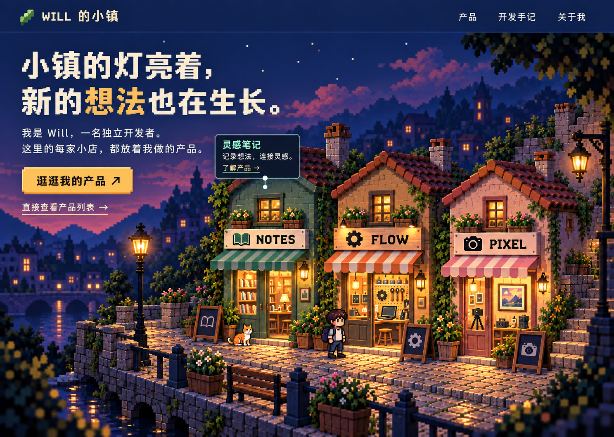

# Will Town · Will 的小镇

一个人，慢慢建起一条街。

以像素小镇呈现独立开发者的产品：每家店代表一个产品，访客可以直接点击店铺，也可以控制像素分身沿街探索。天空与灯光跟随设备当地时间变化。

**当前状态：项目前期设计。仓库已建立，应用代码与可运行演示尚未实现。**

这是 AI 生成的视觉参考，不是运行截图；图中的 NOTES、FLOW、PIXEL 是概念店招，正式内容将替换为真实产品。

## 首版目标

- 一个小广场与三个店面，保持近距离、能看清像素分身和橱窗的取景。
- 完成至少一家店的“发现 → 了解 → 打开真实产品”流程。
- 桌面端方向键 / WASD 走动，靠近后按 E 查看产品，Esc 返回；同时提供直接点击入口。
- 固定角度镜头，小人接近画面边缘时平滑跟随。
- 根据当地时间展示晨曦、上午、午间、下午、黄昏和夜晚，配合预设太阳路径与轻微云动画。
- 支持录制约 25 秒的演示，开发预览可调时间；正常访问按真实时间运行。

## 建议技术栈

TypeScript + React + Vite + Three.js + React Three Fiber，使用 pnpm 管理依赖。具体兼容版本在初始化应用时确认并锁定。

Three.js 渲染小镇，React 组织网页内容，React Three Fiber 将场景组织成可复用组件。首版采用纯前端单应用，没有运行时后端或数据库。

详见 [架构方案](docs/architecture.md)、[昼夜方案](docs/day-cycle.md) 与 [素材制作与管理](assets/README.md)。

## 下一里程碑

初始化应用，制作一个店铺的可运行样片，先验证镜头、素材、灯光与角色移动，再扩展到三个店面。
