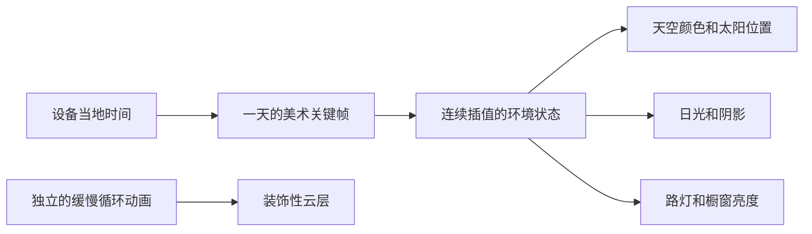

# 像素小镇：跟随本地时间的昼夜氛围

日期：2026-09-13。状态：首版已实现本地时间采样、美术关键帧插值、窗户与路灯变化、太阳预设路径及云层运动；以下为设计约定。

## 1. 已确定的体验

小镇跟随访客设备的当地时间，以真实时间 1:1 流动。早上打开是晨光，中午是晴朗白天，傍晚是暖色夕阳，晚上是蓝紫天空与亮着的橱窗。采用每天重复的晴天美术预设，太阳沿预设轨迹移动，云层缓慢飘动。

本版只需要浏览器本地时间，不需要城市、定位权限、天气接口或后端服务。时段是艺术化近似，不对应当地真实日出日落、季节或极昼极夜。界面如需解释，使用“跟随设备时间”。

环境与小人控制、店铺交互独立：无论当前时段是什么，产品入口始终清楚可见、可以点击。

## 2. 一天的美术安排

下面是可调整的初始设计值，所有访客使用同一张时段表，以各自设备的当地钟点读取。

| 当地时间 | 氛围 | 天空与太阳 | 小镇照明 |
| --- | --- | --- | --- |
| 05:00–07:00 | 晨曦 | 浅紫向桃粉过渡，太阳低位升起 | 路灯逐渐熄灭，橱窗保留暖色 |
| 07:00–11:00 | 上午 | 清蓝天空，太阳逐渐升高 | 温暖柔和的日光 |
| 11:00–15:00 | 午间 | 明亮蓝天，太阳处于高位 | 光线充足，阴影较短 |
| 15:00–18:00 | 下午 | 天空逐渐偏暖，太阳下降 | 斜光渐强，阴影拉长 |
| 18:00–20:00 | 黄昏 | 橙粉转蓝紫，太阳落下 | 店招、路灯与橱窗逐渐亮起 |
| 20:00–次日 05:00 | 夜晚 | 深蓝天空，太阳隐藏，可点缀星星 | 暖色橱窗成为视觉中心，街道仍清晰 |

这些是描述时段的区间，不在整点直接换整套画面。颜色、日光强度、太阳位置与灯光亮度沿一天的关键帧连续过渡；午夜前后的数值保持衔接。夜间可以保持相对稳定。

之前选定的“蓝紫黄昏、暖色橱窗、清晰像素颗粒”作为黄昏与夜晚的视觉基准。其他时段仍保留暖色店招和个人小镇的气质。

## 3. 技术结构

只需三个小模块：

- LocalClock：取得当地小时、分钟和秒，换算为当天已经过去的分钟数；页面恢复时重新读取设备时间。
- DayCycleController：按本地分钟数对相邻美术关键帧插值，输出天空色、太阳方向、日光强度、环境光和橱窗亮度。
- EnvironmentRenderer：把这些参数应用到 Three.js 场景，同时驱动装饰性云层。

时钟采用浏览器 Date 的当地小时、分钟和秒即可。Intl.DateTimeFormat().resolvedOptions().timeZone 可用于可选的时区文字；不必拿到时区字符串才能展示昼夜，也不要给已经是当地时间的数值再加一次时区偏移。

设备时间设置决定展示结果。这里只承诺跟随设备，无需服务端校时。

## 4. 太阳与云如何简化

**太阳采用预设路径。** 为固定视角设计一条从画面一侧升起、经过高处、在另一侧落下的弧线，每天重复。太阳装饰物与主光方向使用同一个环境状态，使可见太阳和阴影大体一致。深夜主日光强度降为零，用柔和环境光维持道路与小人的可见性。

首版使用简单天空渐变、像素太阳贴图和一盏主要方向光即可。清晨、正午、傍晚等关键位置由美术确定，中间缓慢插值。

**云采用固定规则的循环动画。** 使用少量像素云贴图分布在一两层，沿固定方向低速平移，移出范围后在不可见区域回收。云量保持晴天水平，夜间降低亮度。它们不代表当地真实云层，也无需准确模拟风。

云可以持续轻微移动，而太阳按真实一天的速度移动。因此短暂浏览时太阳几乎不动，是正常表现。

## 5. 像素风与性能

建筑与角色素材保留可受场景调色的空间，避免把强烈夕阳阴影永久画死在所有贴图上。店招文字用清晰的 HTML 或足够分辨率的贴图，环境变暗时仍保持可读。

橱窗暖光主要用发光材质、局部光晕和预设地面光斑表现，控制真实光源和实时阴影数量。移动端可使用简化阴影与较少的云。像素颗粒来自受控的渲染分辨率与贴图采样，辉光只做少量点缀。

页面隐藏时暂停视觉动画；回到页面时重新读取当地时间。开启减少动态效果偏好时，云保持静止，关闭大幅转场，但继续展示正确的当地时段。

## 6. 时间更新

首帧就读取当地时间，避免先显示默认黄昏再突然变为正午。环境采样可在已有渲染循环中节流更新，颜色和光照做平滑过渡，无需每帧计算日程。

每天的进度始终来自当前设备时间，不靠累计动画帧数或页面打开时长。因此刷新、休眠、切后台后重新打开都不会让小镇时间落后。

设备时钟或时区发生改变时，在下一次重新采样中跟随新的当地时间，以短暂柔和过渡适应明显跳变。午夜使用循环插值，避免突然闪亮。

## 7. 第一轮实现与验收

先在一个小广场、一家店铺和一个像素分身上完成全天氛围，再复用到整条街。

1. 配好六个时段的天空、主光、环境光和橱窗关键帧。
2. 加入太阳预设轨迹、连续插值与缓慢云动画。
3. 接入设备时间，处理首屏、后台恢复与午夜衔接。
4. 在开发预览中加入时间滑杆，快速检查一天的变化；正式默认按真实时间运行。
5. 检查桌面和手机上的店招、入口、小人以及道路是否全天可辨认。

验收重点：清晨、黄昏和午夜边界没有突变；刷新及后台恢复显示正确时段；改变设备时区后会跟随；环境模块不发起定位或天气网络请求；减少动态效果设置有效。

该阶段的主要工作是把六种光照调得协调，尤其保证白天清爽、黄昏温暖、夜晚可读。时间判断与预设动画本身属于较轻量的前端工作，实际工期还取决于场景和素材是否就绪。
